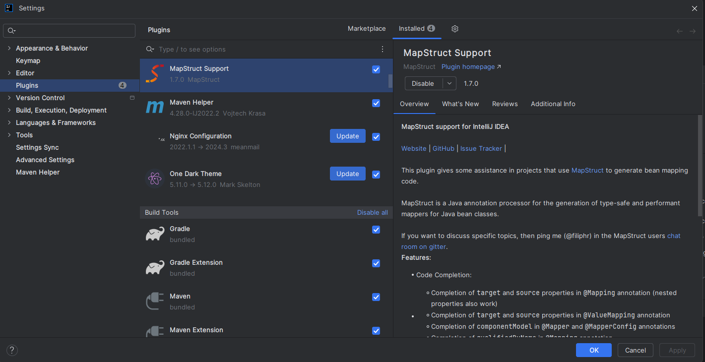

# Konfiguracja

## Wymagane oprogramowanie

* Java 21 (można pobrać zipa i gdzieś rozpakować, np. https://jdk.java.net/java-se-ri/21)
* Docker https://docs.docker.com/desktop/install/windows-install/
* Git https://git-scm.com/downloads
* Intellij https://www.jetbrains.com/idea/download/?section=windows (wesja ultimate jest darmowa dla
  studentów po potwierdzeniu maila, ale jest też darmowa wersja community)

## Instalacja

1. W pierwszej kolejności potrzebujemy stworzyć token autoryzacyjny, aby mieć dostęp do repozytorium
   lokalnie.
    1. https://docs.github.com/en/authentication/connecting-to-github-with-ssh/generating-a-new-ssh-key-and-adding-it-to-the-ssh-agent#generating-a-new-ssh-key
    2. https://docs.github.com/en/authentication/connecting-to-github-with-ssh/adding-a-new-ssh-key-to-your-github-account
2. Sklonuj repo w wybranym przez siebie miejscu.\
   ``git clone git@github.com:Kotki-i-pieski/projekt-inzynierski.git``

## Konfiguracja IDE

1. Importujemy projekt do Intellij (folder backend).
2. Otwieramy **File** &rarr; **Project Structure** i wybieramy folder z pobraną javę 21.
3. W ustawieniach zmieniamy line separator na **Unix and macOS** (ważne):\
   
4. Instalujemy plugin "MapStruct support":\
   

## Uruchomienie aplikacji przez docker

1. Upewniamy się że docker desktop jest uruchomiony.
2. Uruchamiamy docker:\
   ``./start.sh`` - komenda uruchamia dockera (i buduje jeśli nie jest zbudowany).\
   W razię potrzeby przebudowania dockera: `./start.sh --build`
4. Serwer jest uruchmiony na porcie 8080 ([localhost:8080](http://localhost:8080)).\
   Konfiguracja automatycznie supportuje hot-swap, zmiany w kodzie są aplikowane na serwerze
   automatycznie, bez potrzeby przeładowywania serwera. <r>Po zmianach w pom.xml do przebudowania
   serwera należy użyć skryptu `./scripts/recompile.sh` (po uruchomieniu dockera, w osobnym
   terminalu).</r>

## Debugowanie aplikacji przy uruchomieniu z dockera

1. Odpalamy apkę [przez dockera](#uruchomienie-aplikacji-przez-docker).
2. Dodajemy nową konfigurację "Remote JVM Debug" - domyślna konfiguracja oraz port.\
   
3. Uruchamiamy konfigurację.

## Debugowanie/Uruchamianie aplikacji bez dockera (nie polecam)

1. Jest możliwe, ale trzeba postawić sobie ręcznie serwer mysql i ustawić na sztywno zmienne
   śrdowiskowe w **application.yml**.

## WSL

- Jeśli repozytorium mamy na wsl, aby uniknąć problemów z uprawnieniami IDE warto zrobić
  `chmod -R 777` dla całego repozytorium.