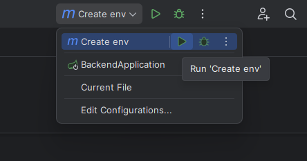
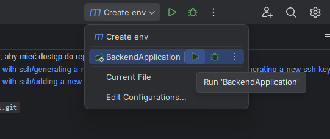

# Konfiguracja

## Wymagane oprogramowanie

* Java 21 (można pobrać zipa i gdzieś rozpakować, np. https://jdk.java.net/java-se-ri/21)
* Docker https://docs.docker.com/desktop/install/windows-install/
* Git https://git-scm.com/downloads
* Intellij https://www.jetbrains.com/idea/download/?section=windows (wesja ultimate jest darmowa dla
  studentów po potwierdzeniu maila, ale jest też darmowa wersja community)

## Instalacja

1. W pierwszej kolejności potrzebujemy stworzyć token autoryzacyjny, aby mieć dostęp do repozytorium
   lokalnie.
    1. https://docs.github.com/en/authentication/connecting-to-github-with-ssh/generating-a-new-ssh-key-and-adding-it-to-the-ssh-agent#generating-a-new-ssh-key
    2. https://docs.github.com/en/authentication/connecting-to-github-with-ssh/adding-a-new-ssh-key-to-your-github-account
2. Sklonuj repo w wybranym przez siebie miejscu.\
   ``git clone git@github.com:Kotki-i-pieski/projekt-inzynierski.git``

## Konfiguracja IDE

1. Importujemy projekt do Intellij (folder backend).
2. Otwieramy **File** &rarr; **Project Structure** i wybieramy folder z pobraną javę 21.
3. W ustawieniach zmieniamy line separator na **Unix and macOS** (ważne):\
   
4. Instalujemy plugin "MapStruct support":\
   
5. Odpalamy konfigurację "Create env", w celu stworzenia pliku .env z danymi do bazy itp.:\

## Odpalanie

1. Po dodaniu env (przez konfigurację w punkcie wyżej, wystarczy odpalić drugą konfigurację:\

   