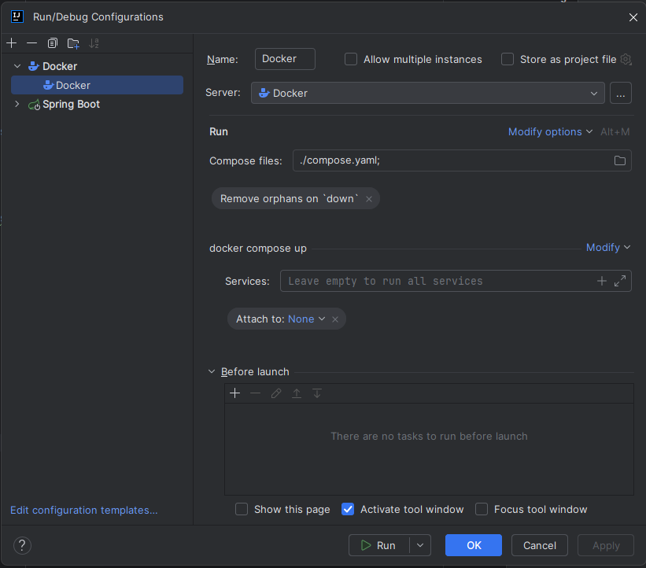

# Konfiguracja

## Wymagane oprogramowanie
* Java 21 (można pobrać zipa  i gdzieś rozpakować, np. https://jdk.java.net/java-se-ri/21)
* Docker https://docs.docker.com/desktop/install/windows-install/
* Git https://git-scm.com/downloads
* Intellij https://www.jetbrains.com/idea/download/?section=windows (wesja ultimate jest darmowa dla studentów po potwierdzeniu maila, ale jest też darmowa wersja community)

## Instalacja
1. W pierwszej kolejności potrzebujemy stworzyć token autoryzacyjny, aby mieć dostęp do repozytorium lokalnie.
   1. https://docs.github.com/en/authentication/connecting-to-github-with-ssh/generating-a-new-ssh-key-and-adding-it-to-the-ssh-agent#generating-a-new-ssh-key
   2. https://docs.github.com/en/authentication/connecting-to-github-with-ssh/adding-a-new-ssh-key-to-your-github-account
2. Sklonuj repo w wybranym przez siebie miejscu.\
``git clone git@github.com:Kotki-i-pieski/projekt-inzynierski.git``

## Konfiguracja IDE
1. Importujemy projekt do Intellij (cały projekt).
2. Otwieramy **File** &rarr; **Project Structure** i wybieramy folder z pobraną javę 21.
3. Otwieramy **File &rarr; Settings Build, Execution, Deployment &rarr; Gradle**, wybieramy javę 21.
4. Importujemy folder backend jako moduł (**File** &rarr; **New** &rarr; **Module from existing sources**).\
Wybieramy opcję **Import module from external model** i wybieramy **gradle**.
5. W ustawieniach zmieniamy line separator na **Unix and macOS**:\


## Uruchomienie aplikacji przez docker
1. Upewniamy się że docker desktop jest uruchomiony.
2. W głównym folderze tworzymy plik **.env** z danymi użytkownika do bazy danych - te dane są losowe na ich podstawie docker tworzy użytkowników, np.:
```
DATABASE_LOGIN=locallogin
DATABASE_PASS=localpass
DATABASE_ROOT_PASS=rootpass
```
2. Budujemy kontenery dockera:
``docker-compose build``
3. Po zbudowaniu możemy odpalić aplikację (odpalona jest aplikacja + serwer mysql).\
Są dwie opcje odpalenia, albo przez komendę albo podpięcie konfiguracji w intellij'u:
   1. W konsoli komenda ``docker-compose up``.
   2. Poprzez konfigurację w intellij'u:\
   \
   
   \
   \
   Teraz możemy uruchomić dodaną konfigurację.
4. Serwer jest uruchmiony na porcie 8080 (localhost:8080).

## Debugowanie javy przy odpaleniu z dockera
1. Odpalamy apkę przez dockera.
2. Dodajemy nową konfigurację "Remote JVM Debug".\
   
3. Uruchamiamy konfigurację.

## Uruchomienie bez dockera
Można uruchomić, ale wtedy trzeba sobie osobno odpalać bazę mysql i dodać dodatkowe zmienne **.env**. Polecam opcję wyżej, a jak nie to piszcie.