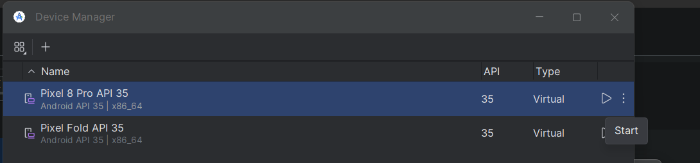

# Konfiguracja
Odpalanie front-endu odpala się poza dockerem, stwierdziłem że nie ma sensu tego podpinać.\

## Wymagania
* Node 20.16.0 https://nodejs.org/en
* Webstorm (lub inny IDE)
* Android studio https://developer.android.com/studio?hl=pl

## Instalacja
1. Zainstaluj dependencje przez npm:\
``npm install``
2. Konfiguracja Android Studio
   1. Wybierz More Actions
   2. Wybierz Virtual Device Manager
   3. Stwórz nowe urządzenie np. Pixel 8 Pro API 35

## Uruchomienie
1. Uruchom backend przez dockera, tak jak w konfiguracji backendu
2. Teraz uruchom komendę
``npm run start``\
Ewentualnie można dodać sobie konfigurację do webpacka, dla oszczędzenia czasu:\

3. W konsoli wybieramy "s"
   1. Jeśli chcemy uruchamiać w przeglądarce wchodzimy po prostu na http://localhost:8081
   2. Jeśli chcemy uruchamiać w symulatorze androida:\
   Uruchamiamy symulator:\
   \
   Po całkowitym uruchomieniu symulatora, wybieramy w konsoli opcję "a"

## Debugowanie
1. W konsoli opcja "j"