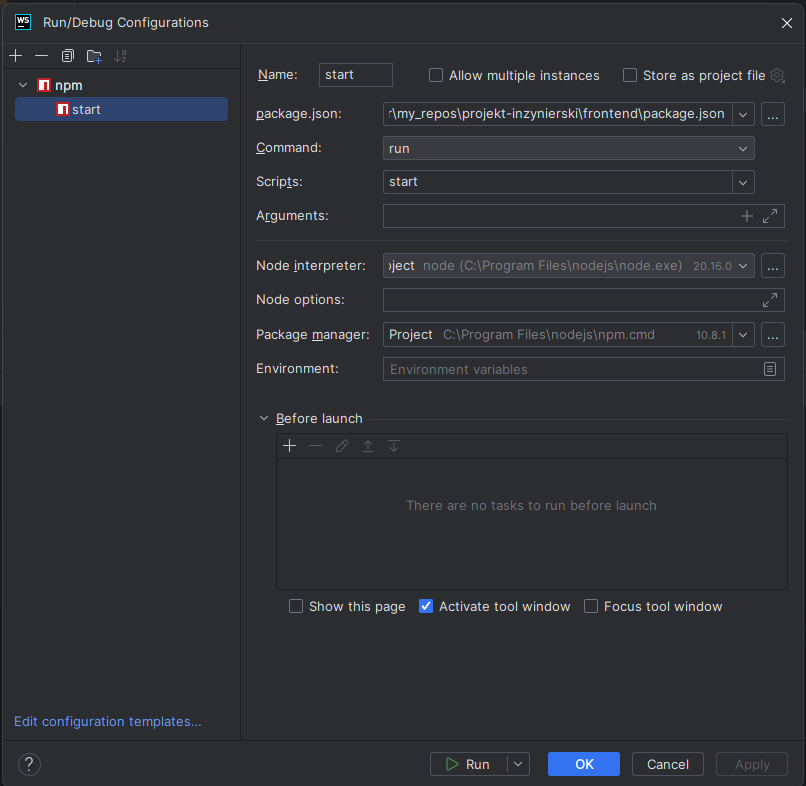

# Konfiguracja
Odpalanie front-endu odpala się poza dockerem, stwierdziłem że nie ma sensu tego podpinać.\

## Wymagania
* Node 20.16.0 https://nodejs.org/en
* Webstorm (lub inny IDE)

## Instalacja
1. Zainstaluj dependencje przez npm:\
``npm install``

## Uruchomienie
1. Uruchom backend przez dockera, tak jak w konfiguracji backendu.
2. Teraz uruchom komendę
``npm run start``\
Ewentualnie można dodać sobie konfigurację do webpacka, dla oszczędzenia czasu:\
